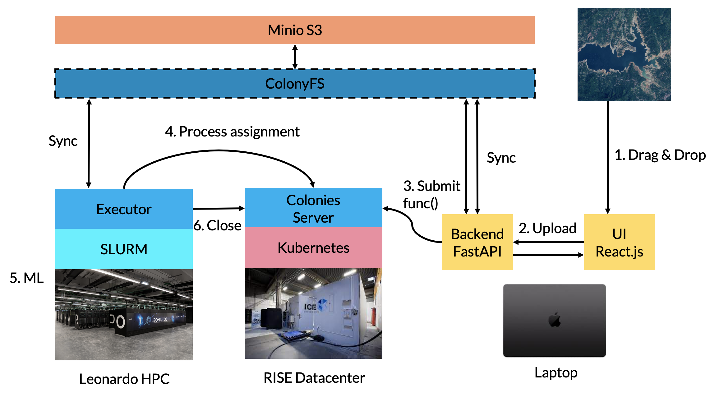

# Introduction 
This is demo application how to use ColonyOS for satelite data analyzis.  




## Train models
```console
cd models/unet
pollinator run --follow
```

## Deploy models 
```console
colonies fs sync -l /eurohpc-summit-demo/pretrained-models -d pretrained-models --keeplocal=true
```

## Deploy Model serving code 
```console
colonies fs sync -l /eurohpc-summit-demo/models/serving -d models/serving --keeplocal=true
```
## Start servers
### React UI
```console
cd ui
npm start
```

Will listen at port :3000.

### React UI
```console
cd backend
./start.sh
```

Will listen at port :8000.
